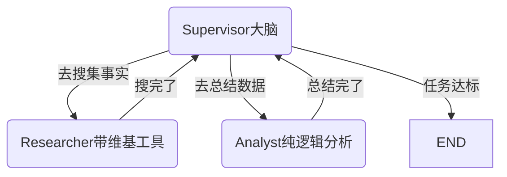

# 阶段四知识核心：多 Agent 协作与生产级架构陷阱

如果说阶段三是一群独立的工作节点，那么阶段四就是一场“交响乐”。我们不再试图让一个全能（但也容易犯大错）的巨型 Agent 包揽所有事情，而是走向分工明确的**多 Agent 协作网络（Multi-Agent Collaboration）**。

在 `04-multi-agent/multi_agent_supervisor.py` 中，我们实践了最重要的架构模式之一：**Supervisor（主管）模式**，同时踩了几个在真正生产环境中极度致命的坑。

---

## 👔 核心概念一：Supervisor 路由调度模式
不要把所有的工具都塞给一个大脑。大模型的**上下文注意力非常容易分散**。

在 Supervisor 模式中：
1. **中心节点（Supervisor）完全剥离了物理工具**。它的职责极度单一：阅读当前的历史研报，决定下一步该派谁上场。
2. **专业节点（Researcher / Analyst）高度垂直**。研究员专门带检索工具，分析师专门负责总结。它们就像微服务，高内聚低耦合。


**最大的好处**：整个任务链条高度清晰。不管子节点死循环了还是崩溃了，主控流始终在 Supervisor 手里。

---

## 📦 核心概念二：子图黑盒化（使用 `create_agent`）
在一个图里，如果节点内部本身就需要循环（比如研究员没搜到满意的维基百科词条，需要继续搜），主图会变得极其发散且难以维护。

在我们的代码中：
```python
researcher_agent = create_agent(
    model=llm,
    tools=[wikipedia_tool],
    system_prompt="你是一名专业的研究员..."
)
```
这段代码直接生成了一个内部自带 `Agent -> Tool -> Agent` 循环的子黑盒。
对于外部的 Supervisor 主体图来说，`researcher_node` 仅仅是一个**“吃进输入，吐出结果”**的单步节点。这就是 LangGraph 在架构上最大的魅力所在：图可以无限嵌套。

*注意：LangGraph v1 已经弃用了 `create_react_agent`（它曾经需要 `state_modifier` 参数），请拥抱 `langchain.agents` 库下的 `create_agent`（使用标准的 `system_prompt`）。*

---

## 💣 生产级经验教训：不要迷信模型指令

在本次落地中，我们真正体会到了理论演示与生产落地的差距，重点记录两大“血泪”教训：

### 1. 结构化输出（Structured Output）的幻觉与兼容性
为了让 Supervisor 稳定输出下一个节点的名字，通常会使用 `llm.with_structured_output` 强制要求输出 JSON，如 `{"next": "Researcher"}`。
* **踩坑**：很多非原生 OpenAI 模型（如 DeepSeek、国产大模型等）在部分 API 渠道下，直接调用 `response_format: json_schema` 会抛出 HTTP 400 异常。
* **解决**：回归**提示词工程 + 软解析**的本质。
  我们在 Prompt 中强硬规定：`请在回复的最后一行只输出下一个执行者的名字，不要带任何标点。`
  然后在 Python 侧使用切片提取：`response.content.strip().split("\n")[-1]`。
  这种方法在兼容性和鲁棒性上，往往超越了脆弱的 API 特性。

### 2. 死循环与代码层强护栏（Guardrails）
* **踩坑**：在测试中，Supervisor 调度 Analyst 完成总结后，理应判断任务结束并输出 `FINISH`。但在 Prompt 里大写加粗了“一旦 Analyst 输出总结必须 FINISH”、“绝对不要连续派同一个人”，在多轮对话上下文冲刷下，LLM 依然出现了**持续复读调度 Analyst 的死循环**（图递归超限报错）。
* **破局核心理念**：这也是 AI 架构师的铁律 —— **绝对不要把系统的状态流转不变量（Invariants）完全交托给 LLM 的智能去维系。**
* **解决**：引入代码层面的强干预。
  在图的全局状态表 `AgentState` 中新增 `last_speaker` 字段。每次成员节点发完言就盖个戳。在 Supervisor 的路口写下铁律代码：
  ```python
  if next_node == last_speaker and next_node != "FINISH":
      # 侦测到 LLM 正在违令重复派发同一个角色，强制拦截并篡改路线！
      next_node = "FINISH" 
  ```
  在防范无限死循环时，`if-else` 的确定性永远是 LLM 不确定性的最后一道防线。

---

## 🚀 总结

第四阶段与其说我们在学“多 Agent 怎么聊天”，不如说是我们在学习**微服务架构思想在 AI 编排中的映射**。
你已经掌握了利用图结构拆解任务，以及利用代码断言控制 AI 脱轨的最重要技巧。

接下来，我们将带着这份对系统健壮性的理解，走向最终的终极挑战：端到端实战项目！
