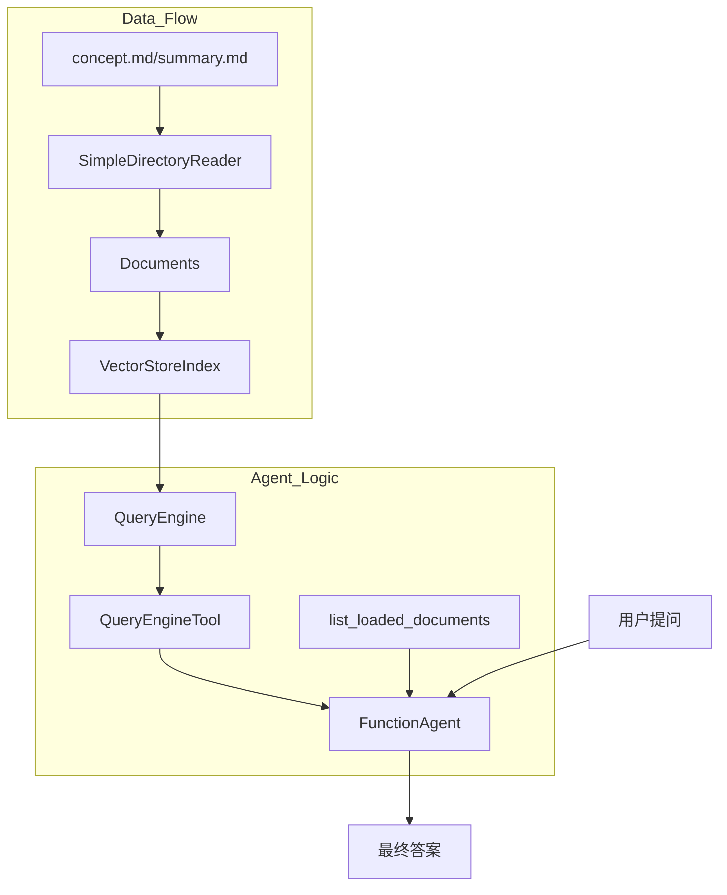

# LlamaIndex 源代码深度解析与对比

> 本文档针对 `10-llamaindex-agent/llamaindex_agent.py` 的实现逻辑进行详细梳理，重点对比 LlamaIndex 与 LangChain/LangGraph 的设计差异。

---

## 一、 核心概念：LlamaIndex 的“三层架构”

LlamaIndex 在处理数据流时遵循清晰的分层设计：

### 1. Ingestion 层（数据接入）
*   **对应代码**：`SimpleDirectoryReader(input_files=...).load_data()`
*   **概念**：`Document`。这是原始数据的封装。
*   **解析**：LlamaIndex 的 Reader 通常会自动识别文件类型并提取元数据（如文件名、修改时间等）。

### 2. Indexing 层（数据索引）
*   **对应代码**：`VectorStoreIndex.from_documents(documents)`
*   **概念**：`Node` 与 `Index`。
*   **解析**：LlamaIndex 会自动将 `Document` 切分（Chunking）成更小的 `Node`（语义块），并构建 `Index`（如向量索引）。

### 3. Querying 层（数据查询）
*   **对应代码**：`index.as_query_engine(similarity_top_k=3)`
*   **概念**：`QueryEngine`。
*   **关键点**：`QueryEngine = Retriever（检索器） + Synthesizer（合成器）`。它不仅负责检索相关片段，还会直接调用 LLM 把片段总结成最终答案。

---

## 二、 关键代码细节解析

### 1. `Settings`：全局配置中心
```python
Settings.llm = create_llm()
Settings.embed_model = MockEmbedding(embed_dim=1536)
```
*   **解析**：LlamaIndex 使用单例模式的 `Settings` 来管理全局默认组件。设置后，后续所有的 Index 和 Agent 都会默认使用这些组件，无需在每个函数中重复传递。

### 2. `MockEmbedding`
*   **解析**：本示例使用了“伪 Embedding”，它会生成固定维度的随机向量。这在学习数据流、测试工具调用逻辑时非常高效，因为它不需要消耗 API 额度，且运行速度极快。

### 3. `FunctionAgent` (Workflow 模式)
*   **解析**：这是 LlamaIndex 最新的事件驱动架构实现方式。开发者只需提供工具（Tools），Agent 会自动处理 ReAct（思考-行动-观察）循环，其黑盒程度比手动绘制 LangGraph 状态图更高，但开发效率也更高。

---

## 三、 代码流转图



---

## 四、 核心差异对比表

| 维度 | LlamaIndex | LangChain / LangGraph |
| :--- | :--- | :--- |
| **设计哲学** | 数据中心型，声明式 API | 流程中心型，显式链/图编排 |
| **组件耦合** | 默认高度集成（QueryEngine 包含 LLM） | 组件松耦合（需手动拼接 Retriever 和 LLM） |
| **配置管理** | 全局 `Settings` 单例 | 显式传递参数 |
| **Agent 编排** | 偏向于封装好的 `FunctionAgent` | 偏向于手写 `StateGraph` |
| **优势场景** | 复杂 RAG、知识库问答、快速原型 | 复杂状态机、审批流、多 Agent 协作 |

---

## 五、 源码梳理结论

1.  **数据的“元数据” (Metadata)**：LlamaIndex 在读取文件时自动记录 `file_name`，这在 `list_loaded_documents` 函数中被直接利用，体现了数据驱动的便利性。
2.  **工具化思想**：`QueryEngineTool` 证明了知识库本身可以作为 Agent 的一个“技能”。
3.  **从流程到数据的转变**：学习 Stage 10 的核心在于理解：**当数据量巨大且结构复杂时，优秀的索引结构和查询策略比手画复杂的流程图更重要。**
