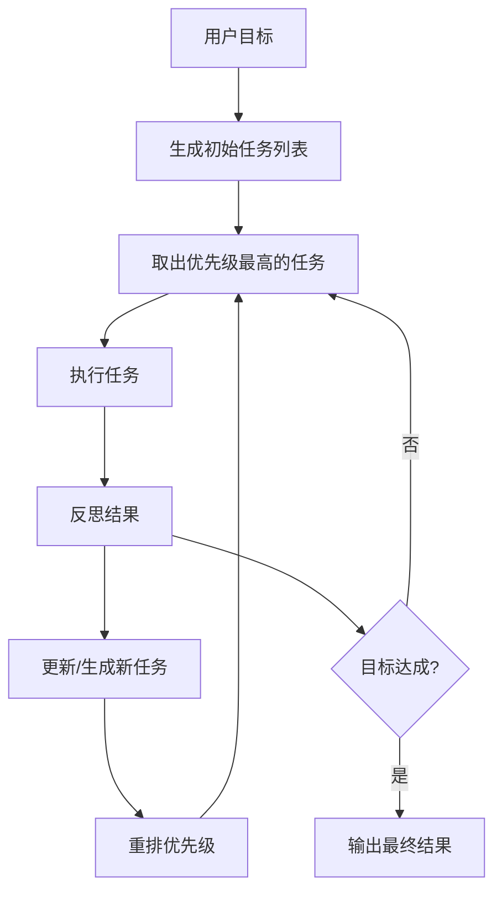

# 自主任务循环：BabyAGI 架构模式

> 本文是阶段 12 的概念预习文档。我们将深入探讨自主任务循环（Autonomous Task Loop）的底层逻辑，并为手写 `task_queue_agent.py` 做准备。

---

## 一、什么是自主任务循环

传统的 ReAct 模式（如阶段 03）通常是“感知 -> 思考 -> 行动 -> 观察”的单次或简单循环。

而**自主任务循环**（以 BabyAGI 和 AutoGPT 为代表）更进一步，它引入了**显式的任务管理系统**。用户只需要给出一个“长期目标（Goal）”，Agent 会自动拆解任务、管理优先级，并持续迭代直到目标完成。

---

## 二、BabyAGI 的三环结构

BabyAGI 是最经典的自主 Agent 最小实现，它的核心逻辑由三个循环组成：

### 1. 任务执行（Task Execution）
从任务列表中取出一个任务，调用 LLM 或工具完成它。

### 2. 任务生成/更新（Task Creation）
根据刚刚完成的任务结果和当前目标，判断是否需要生成新的子任务。

### 3. 任务排序（Task Prioritization）
对当前任务列表进行重新排序，确保最有价值的任务排在前面。

---

## 三、核心流程图

---

## 四、为什么它比普通 Agent 难

自主循环在 Demo 中看起来很惊艳，但在实际工程中面临巨大挑战：

1.  **目标漂移（Goal Drift）**：Agent 可能在执行子任务的过程中迷失，最终离初始目标越来越远。
2.  **无限循环（Dead Loop）**：在两个相互依赖的任务之间反复横跳，消耗大量 Token。
3.  **成本不可控**：如果没有终止条件，Agent 可能会跑上一整晚，耗尽 API 余额。
4.  **低质量产物**：如果中间某个环节出错，错误的结论会作为下一个环节的输入，导致“垃圾进，垃圾出”。

---

## 五、工程化优化策略

为了让自主 Agent 变得可用，我们需要在 `task_queue_agent.py` 中引入以下约束：

- **Max Loops**：设置强制最大循环次数。
- **Memory Context**：使用向量数据库或简单的任务历史记录，避免重复劳动。
- **Human-in-the-loop (HITL)**：在生成新任务或执行关键步骤前，请求人类确认。
- **Structured Output**：使用 JSON 或 Pydantic 强制要求 Agent 输出结构化的任务列表。

---

## 六、阶段 12 学习路线

1.  **实现任务列表类**：管理任务的添加、取出和状态。
2.  **实现三个核心 Agent 节点**：执行节点、生成节点、重排节点。
3.  **编写主循环逻辑**：控制各节点的流转。
4.  **加入反思与停止机制**：判断目标是否已达成。
