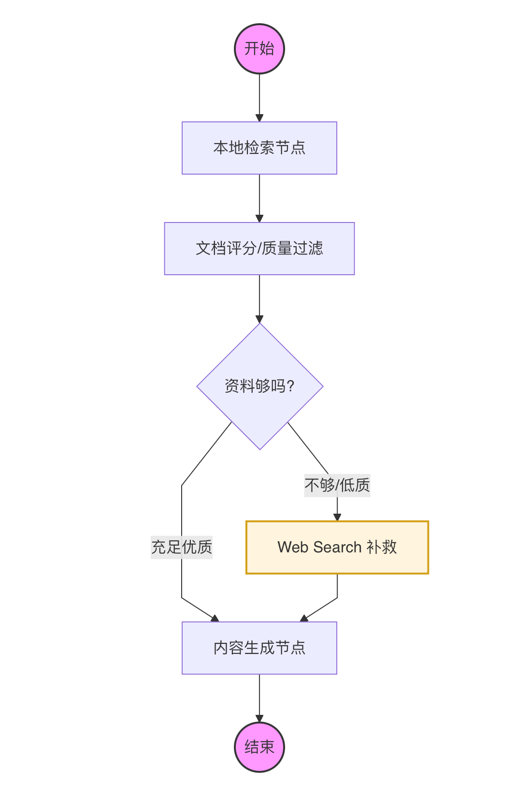
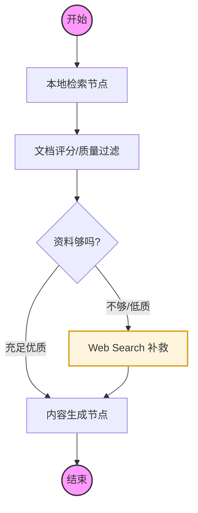

# 深入浅出 AI Agents：从核心原理到多框架实战

本项目是一个系统化的 AI Agents 学习仓库。记录了从最基础的工具调用、记忆系统，到生产级 LangGraph 复杂图架构，以及主流 Agent 框架（smolagents, CrewAI, AutoGen）横向对比的完整演进过程。

---

## 🌟 核心亮点

- **生产级 Self-RAG**：基于 LangGraph 实现的具备“自愈、自评、自检索”能力的 RAG 系统，包含全链路可观测性监控。
- **多框架横向实验室**：同一业务场景在 **LangGraph**, **smolagents**, **CrewAI**, **AutoGen** 下的不同实现与性能对比。
- **代码执行深度机制**：深度剖析了“AST 沙箱模拟”与“物理进程隔离”两种代码执行方案的差异。
- **第二阶段路线图**：继续扩展 LlamaIndex、MetaGPT、AutoGPT/BabyAGI、技能库、Dify/Coze 与生产级 Agent 工程。

## 🏗️ 核心架构可视化：Self-RAG (阶段 05)

本项目最核心的生产级范式实现是一个具备“反思与补救”能力的 Self-RAG 系统。



<details>
<summary>点击查看 Mermaid 架构源代码 (可复制用于修改)</summary>


</details>

---

## 🛠️ 环境准备

```bash
# 克隆项目后
python3 -m venv venv
source venv/bin/activate

# 推荐：按当前学习阶段安装轻量依赖
pip install -r requirements/base.txt

# 示例：只学习阶段 10 LlamaIndex 时
pip install -r requirements/phase10-llamaindex.txt

# 如需一次性安装所有阶段依赖，再使用全量入口
# pip install -r requirements.txt
```

> 注意：`requirements.txt` 是全量聚合入口，会安装 CrewAI、AutoGen、sentence-transformers、LlamaIndex 等多个生态的依赖，解析和下载时间较长。日常学习建议优先使用 `requirements/` 下的分阶段依赖文件。

**环境变量配置**：
请在 `.env` 文件中配置以下内容：
- `OPENAI_API_KEY` / `OPENAI_BASE_URL`: 大模型接口
- `TAVILY_API_KEY`: 搜索工具
- `LANGFUSE_SECRET_KEY / PUBLIC_KEY`: 可观测性分析（可选）

---

## 🗺️ 学习路线与目录索引

| 阶段 | 模块 | 内容要点 |
| :--- | :--- | :--- |
| **01-02** | [核心概念](./01-core-concepts/) | Tool, Prompt, Memory 的最小 Demo |
| **03** | [LangGraph 基础](./03-langgraph-agent/) | ReAct 规划、状态机节点与边 |
| **04** | [多 Agent 协作](./04-multi-agent/) | Supervisor 模式与任务分发 |
| **05** | [**生产级项目实战**](./05-final-project/) | **重点**：Self-RAG 闭环、Pydantic 状态管理、Langfuse 追踪 |
| **06** | [smolagents](./06-smolagents-intro/) | **代码即操作**：AST 级别安全的代码执行智能体 |
| **07** | [CrewAI](./07-crewai-intro/) | **职场角色扮演**：基于 Backstory 与任务流水线的团队协作 |
| **08** | [AutoGen](./08-autogen-intro/) | **对话式自愈**：Agent 之间的聊天、自动运行代码与报错修正 |
| **09** | [**执行机制深度挖掘**](./09-execution-depth/) | 深度辨析 AST 解析与 Subprocess 执行的安全性与差异 |

### 第二阶段：从框架分类到模式体系

第一阶段解决的是“如何构建一个能调用工具、管理状态、协作执行任务的 Agent”。第二阶段将继续研究更完整的 Agent 模式体系：

| 阶段 | 方向 | 学习重点 | 状态 |
| :--- | :--- | :--- | :--- |
| **10** | [LlamaIndex 数据中心型 Agent](./10-llamaindex-agent/) | 数据索引、Query Engine、Agentic RAG、企业知识库 | 已完成 ✅ |
| **11** | [MetaGPT / SOP 多 Agent](./11-metagpt-sop/) | 软件工程 SOP、结构化中间产物、角色协作约束 | 已完成 ✅ |
| **12** | [自主任务循环 Agent](./12-autonomous-agents/) | AutoGPT / BabyAGI 风格的任务队列、反思、停止条件 | 已完成 ✅ |
| **13** | [技能库与长期学习](./13-skill-library-agent/) | Voyager 风格技能沉淀、检索复用、版本管理 | 已完成 ✅ |
| **14** | [低代码 Agent 平台](./14-lowcode-agent-platforms/) | Dify / Coze 的工作流、知识库、插件和发布能力 | 已完成 ✅ |
| **15** | [生产级 Agent 工程](./15-production-agent-engineering/) | 评估、观测、安全、权限、失败恢复、人类介入 | 已完成 ✅ |

完整路线见：[**Agent 第二阶段学习路线图**](./docs/plan2.md)。

---

## 📖 核心总结与图谱

- [**AGENTS_KNOWLEDGE_MAP.md**](./AGENTS_KNOWLEDGE_MAP.md)：本项目最终沉淀的 **Agent 开发全景知识图谱**，涵盖了四大框架的性格对比及选择建议。
- [**docs/plan2.md**](./docs/plan2.md)：第二阶段学习路线图，围绕 Agent 框架分类、模式体系和后续阶段规划展开。

---

## 🚀 开发者箴言

> 所有的探索都是为了在面对真实业务需求时，不仅知道“怎么做”，更知道“为什么这么做”以及“有没有更好的替代方案”。

**祝您的智能体永不报错！✨👋**
