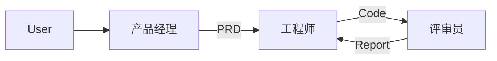

# 深入浅出 AI Agents：从核心原理到全栈实战

> **这是一个系统化的 AI Agents 开发者学习路线。** 涵盖了从最基础的原子组件（Tools/Memory）、生产级架构（LangGraph/Self-RAG）、主流 Agent 框架横向对比（CrewAI/AutoGen）、到前沿模式（SOP/技能库/自主循环）的全方位实战。

---

## 🌟 本项目能带给你什么？

本仓库不只是代码的堆砌，它沉淀了一套 **Agent 架构师的决策逻辑**：

*   **全栈范式**：从手写 ReAct 到使用 LlamaIndex/LangGraph 构建复杂工作流。
*   **多框架实验室**：深度对比 **LangGraph**, **smolagents**, **CrewAI**, **AutoGen**, **MetaGPT**。
*   **工程化深度**：覆盖代码执行安全（AST）、多 Agent 协作约束（SOP）、量化评估（RAGAS）与生产级护栏（Guardrails）。
*   **前沿模式**：复现了 Voyager 的**技能库（Skill Library）**思想与 BabyAGI 的**自主任务循环**。

---

## 🗺️ AI Agent 开发者路线图 (1-15 阶段)

本项目由浅入深分为四大版块，所有阶段均已完成并配有可运行代码。

### 1. 核心原理与基础编排 (Foundation)
| 阶段 | 模块 | 核心内容 | 实战入口 |
| :--- | :--- | :--- | :--- |
| **01-02** | **原子组件** | 工具调用、Prompt 模板、短期/长效记忆 | [01-concepts](./01-core-concepts/) / [02-assistant](./02-research-agent/) |
| **03-04** | **流程编排** | LangGraph 状态机、ReAct 规划、多 Agent 主管模式 | [03-langgraph](./03-langgraph-agent/) / [04-multi-agent](./04-multi-agent/) |
| **05** | **生产级闭环** | **Self-RAG 系统**：具备自愈、自评、自检索能力 | [**05-final-project**](./05-final-project/) |

### 2. 多框架深度对比实验室 (Framework Lab)
| 阶段 | 框架 | 性格与适用场景 | 核心机制 |
| :--- | :--- | :--- | :--- |
| **06** | **smolagents** | 代码即操作：极致简洁的工具调用 | [AST 代码智能体](./06-smolagents-intro/) |
| **07** | **CrewAI** | 职场角色扮演：基于 Backstory 的团队协作 | [任务流编排](./07-crewai-intro/) |
| **08** | **AutoGen** | 对话式自愈：Agent 之间的动态博弈与报错修正 | [多 Agent 会话](./08-autogen-intro/) |
| **09** | **执行安全** | 深度辨析 AST 解析与 Subprocess 执行的安全性 | [执行深度挖掘](./09-execution-depth/) |

### 3. 高级进阶模式 (Advanced Patterns)
| 阶段 | 模式 | 解决的核心问题 | 实战入口 |
| :--- | :--- | :--- | :--- |
| **10** | **数据中心型** | LlamaIndex 赋能的 Agentic RAG 与企业知识库 | [LlamaIndex](./10-llamaindex-agent/) |
| **11** | **SOP 驱动型** | MetaGPT：用软件工程 SOP 约束多 Agent 产出 | [MetaGPT/SOP](./11-metagpt-sop/) |
| **12** | **自主循环型** | BabyAGI：目标驱动的任务队列与动态优先级 | [自主任务流](./12-autonomous-agents/) |
| **13** | **技能学习型** | Voyager 风格：将成功经验沉淀为可复用技能库 | [技能库 Agent](./13-skill-library-agent/) |

### 4. 生产化治理与平台 (Engineering & Platform)
| 阶段 | 主题 | 核心工具与方法 | 实战入口 |
| :--- | :--- | :--- | :--- |
| **14** | **低代码平台** | Dify / Coze：从硬核开发到可视化编排的取舍 | [平台对比分析](./14-lowcode-agent-platforms/) |
| **15** | **生产级工程** | RAGAS 评估、Langfuse 追踪、安全护栏 (Guardrails) | [工程实战代码](./15-production-agent-engineering/) |

### 5. 💎 生产环境生存指南 (Architecture Deep Dives)
> **强烈推荐中高级开发者阅读**：本部分脱离了基础的 API 调用，专注于大模型底层原理、深度数据清洗（ETL）、分布式状态机架构（Checkpoint）以及安全评估。

| 主题 | 核心内容 | 深度指南入口 |
| :--- | :--- | :--- |
| **高阶架构** | vLLM/量化选型、GraphRAG、断点续传、Prompt 注入防御 | [👉 进入进阶全景图](./architecture-deep-dives/README.md) |

---

## 🏗️ 典型架构方案展示

### 方案 A：Self-RAG (自愈型检索增强)
适用于对回答准确度有极高要求的知识库场景。


### 方案 B：SOP 驱动的多 Agent 协作
适用于软件开发、内容生产等具有标准作业程序的复杂流程。



---

## 🛠️ 快速开始

### 1. 基础环境
```bash
python3 -m venv venv
source venv/bin/activate

# 推荐：按需安装阶段依赖（以阶段 05 为例）
pip install -r requirements/base.txt
# pip install -r requirements/phase05-rag.txt
```

### 2. ⚠️ 特殊阶段说明 (MetaGPT)
**阶段 11 (MetaGPT)** 由于依赖冲突，必须使用独立的 Python 3.11 环境。
具体配置请参考：[11-metagpt-sop/README.md](./11-metagpt-sop/README.md)。

### 3. 配置环境变量
复制 `.env.example` 为 `.env` 并填入：
- `OPENAI_API_KEY` / `OPENAI_BASE_URL`
- `MODEL_NAME` (推荐 `deepseek-chat`)
- `TAVILY_API_KEY` (搜索功能必需)

---

## 📖 核心资产与路线图

- [**AGENTS_KNOWLEDGE_MAP.md**](./AGENTS_KNOWLEDGE_MAP.md)：四类 Agent 框架性格对比及选择建议。
- [**docs/plan2.md**](./docs/plan2.md)：本项目背后的设计心路历程与架构演进图谱。

---

## 🚀 结语
> 所有的探索都是为了在面对真实业务需求时，不仅知道“怎么做”，更知道“为什么这么做”以及“有没有更好的替代方案”。

**祝您的智能体永不报错！✨👋**
