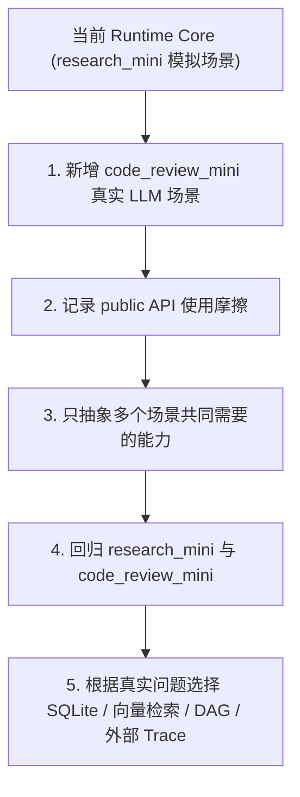

# Agent Runtime Core 项目状态与进展评估报告

本报告对 `practice-projects/06-agent-runtime-core` 项目的设计定位、当前进度、技术实现、局限性及未来演进路径进行了全面的梳理与评估。

---

## 1. 项目定位与架构概述

`06-agent-runtime-core` 是一个**小步验证开发项目**，旨在验证 Agent 运行时的核心公共支撑能力。项目当前不追求完整的生产级 Runtime，而是聚焦于验证“上下文、状态、记忆、结构化产物、Trace 和可恢复执行”的核心闭环。

### 架构职责边界
Runtime Core 坚持“小核心”原则，不直接嵌入任何具体的业务推理或场景 Step，而是将它们解耦至 `scenarios/` 目录中。其公共支撑架构按职责划分为六个核心包：

```
task -> context -> memory -> artifact -> execution -> observability
```

*   **`task`**: 定义任务契约（`TaskContract`）与最小状态模型（`RuntimeState`）。
*   **`context`**: 负责为当前 Step 构造只包含必要工作视图的上下文包（`ContextBundle`）。
*   **`memory`**: 管理跨任务可复用的记忆记录（`MemoryRecord`），包括写入门控和生命周期。
*   **`artifact`**: 支持 Step 之间通过带有 Schema 校验的结构化产物（`ArtifactRecord`）进行交接。
*   **`execution`**: 提供顺序执行器（`StepRunner`）、最小工具策略检查器（`ToolPolicyChecker`）和 Runtime 串联。
*   **`observability`**: 提供文件级别的 Checkpoint 存储与 JSONL Trace 事件记录/复盘。

---

## 2. 阶段验证进度评估

项目文档规划了六个验证阶段。经代码审计和脚本运行验证，**当前所有阶段均已完成最小验证（Status: Completed）**，单元测试（共 38 个 Test Cases）全部通过。

| 阶段 | 能力目标 | 验证状态 | 验证说明与运行脚本 |
| :--- | :--- | :--- | :--- |
| **Phase 1** | **Context Builder** | **Completed** | 上下文被视为当前 Step 的工作视图而非单纯的 Chat History。支持基于 Tag 相关性、安全信任级和敏感度过滤候选，控制字符预算，并进行 Required Context 检查。<br>`scripts/run_context_demo.py` |
| **Phase 2** | **Memory / State 分层** | **Completed** | 明确划分了三种概念：Memory（跨任务经验）、State（当前任务进度）、Artifact（阶段产物）。设计了 `MemoryWriteGate` 门控以控制记忆的写入时机。<br>`scripts/run_memory_state_demo.py` |
| **Phase 3** | **Checkpoint / Resume** | **Completed** | 实现了文件级快照和顺序执行器。当任务中断后，支持基于 Checkpoint 恢复并自动跳过（Skipped）已通过的 Step。<br>`scripts/run_resume_demo.py` |
| **Phase 4** | **Schema Artifact 交接** | **Completed** | 验证了 Step 之间通过可校验的 Pydantic 模型（如证据表、报告草稿）进行交接。当下游消费上游产物时进行 Schema 强校验。<br>`scripts/run_artifact_handoff_demo.py` |
| **Phase 5** | **Trace 与复盘** | **Completed** | 采用本地 JSONL 格式记录任务、步骤、产物与工具调用等核心事件。支持在写入时进行敏感凭证（如 API Key）脱敏，并提供快速定位失败的复盘引擎。<br>`scripts/run_trace_demo.py` |
| **Phase 6** | **最小 Runtime 串联** | **Completed** | 在 `research_mini` 场景下成功串联了上述所有能力，演示了完整运行、中断恢复（Resume）和因工具越权导致的阻塞（Blocked）处理。<br>`scripts/run_research_mini.py` |

---

## 3. 技术亮点与设计优势

1.  **高内聚低耦合的业务与框架分离**：
    *   `MinimalRuntime` 不包含任何业务推理。所有的具体步骤和产物 Schema 全都在 `scenarios/research_mini` 内定义。
    *   通过 `test_runtime_core_boundaries.py` 约束了依赖方向，严禁 `runtime_core/` 反向依赖 `scenarios/`。
2.  **严密的工作上下文治理**：
    *   `ContextBuilder` 不会无脑堆砌历史，而是通过 Tag 匹配、敏感词拦截、未验证记忆拦截、外部不可信候选拦截等策略，保证工作视图的高相关性与安全性。
3.  **受控的长期记忆写入机制**：
    *   打破了“运行过程中随时随手写入记忆”的混乱模式。通过 `MemoryWriteGate` 执行 `reject`、`propose` 或 `activate` 决策，要求记忆必须具备跨任务复用价值和高可信度。
4.  **清晰的结构化数据交接**：
    *   Step 之间通过 `ArtifactStore` 以 Pydantic Schema 进行交互，极大地避免了传统基于大模型自由文本进行信息提取时字段缺失或格式损坏的隐患。
5.  **工程化中断与阻塞机制**：
    *   不仅支持基于 Checkpoint 自动恢复（自动跳过已执行 Step），更将 `Blocked`（如因权限不足、需要人机协同）作为一种规范化的系统终态，并生成了包含“建议动作”的人机协同事件。

---

## 4. 局限性与尚未实现的能力

作为一个以“小步验证”为目的的 Sandbox 项目，当前实现存在以下客观局限性：

*   **持久化层缺失**：`MemoryStore` 和 `ArtifactStore` 当前均为纯内存实现，程序退出即丢失。为了支持跨进程 Resume，目前只通过在 `MinimalRuntime` 中序列化一个临时 `artifacts.json` 作为妥协方案。
*   **缺少真实大模型（LLM）驱动**：`research_mini` 场景采用的是模拟的确定性步骤（Deterministic Steps），这使得我们无法评估在大模型推理波动性下，上下文匹配和记忆提取的稳定度。
*   **轻量但简单的关联规则**：记忆和上下文的相关性过滤仅依赖于基础的 Tag 重合度（Tag Overlap Check），不包含向量数据库检索（Vector Search）与 LLM 语义相似度判别。
*   **基础的安全防护**：凭证脱敏依赖的是局部字符匹配规则（如匹配 `token=`），并没有接入完整的 Secret Scanner；同时未实现针对 Prompt Injection（提示词注入）等高级安全防护。
*   **单一执行链路**：目前的 `StepRunner` 仅支持顺序依赖的线性 Step，不支持复杂的有向无环图（DAG）流式调度。
*   **外部观测集成**：Trace 系统使用纯本地 JSONL 文件，缺乏与 Langfuse、LangSmith 或 Phoenix 等成熟的 Trace 服务端集成。

---

## 5. 后续路线：场景驱动优化 Runtime Core

当前阶段不宜直接推进“生产级 Runtime Core”建设。更合适的路线是：先新增具体 Agent 场景，强制复用现有 Runtime Core public API，在真实使用中暴露接口摩擦和能力缺口，再决定是否优化核心模块。

推荐工作方式：

```text
具体 Agent 场景
  -> 复用 Runtime Core
  -> 记录接口不顺、边界不清、能力缺口
  -> 只针对真实问题优化 Runtime Core
  -> 用场景和测试回归验证
```

### 建议 1：新增真实 LLM 场景（高优先级）

下一步最值得做的是新增一个依赖真实 LLM 调用的具体场景，而不是先补存储、向量检索或 DAG 调度器。

已新增 `code_review_mini` 作为第一个场景驱动试验：

*   它和前期 D-lite、LLM review、自愈修复等实践经验有延续关系。
*   它比完整运维自愈更小，更适合观察 Runtime Core 的使用边界。
*   它验证了 `ContextBuilder`、`ArtifactRecord`、`TraceRecorder`、`ToolPolicyChecker`、`Blocked` 等能力在非 research 场景下仍可复用。

该场景建议先覆盖：

| 能力 | 场景验证方式 |
| :--- | :--- |
| Context Builder | 给定代码片段、检查目标、项目 review 偏好，构造当前 review step 的工作视图 |
| Schema Artifact | 输出 `CodeSnapshot`、`ReviewReport`、`PatchSuggestion` 等结构化产物 |
| Trace | 记录文件读取、reviewer 调用、patch policy 检查和 blocked 原因 |
| Memory | 保存项目级 review 偏好；后续可继续观察 `MemoryWriteGate` 写入时机 |
| Tool Policy | 对读取文件、生成 patch suggestion、写入 patch 做风险区分 |
| Blocked | 当 patch writer 需要人工审批时进入 blocked |

### 建议 2：把生产级能力降级为 Backlog（中低优先级）

下面这些能力都有价值，但不建议立即实现。它们应由后续场景中的真实摩擦触发，而不是按生产级路线图预先建设。

| 能力 | 当前处理 | 触发条件 |
| :--- | :--- | :--- |
| SQLite 持久化 | 暂缓 | 新场景确实需要跨进程保存 memory / artifact，且 `artifacts.json` 快照明显不够 |
| 向量检索 | 暂缓 | tag / scope / confidence 规则无法满足真实上下文选择，且已有足够记忆样本 |
| DAG 调度器 | 暂缓 | 线性 step 无法表达真实 Agent 流程，并且出现多个可并行或条件分支 step |
| Langfuse / LangSmith / Phoenix | 暂缓 | 本地 JSONL trace 已无法支持复盘、对比和多人协作查看 |
| Secret Scanner / Prompt Injection 防护 | 按需补充 | 新场景开始处理真实外部文本、代码仓库或工具输出时优先补充 |

### 3. 调整后的演进路线推荐图

新的路线不再是从 Sandbox 直接推向生产级 Runtime，而是先通过多个具体场景反复验证核心抽象。



---

## 6. 项目验证与演示指南

您可以在根目录下直接运行以下命令来复现和验证当前项目状态：

### 1. 运行完整的研究 Agent 模拟场景
```bash
python3 practice-projects/06-agent-runtime-core/scripts/run_research_mini.py --reset
```

### 2. 模拟中断并成功恢复（观察 Skipped Steps）
```bash
# 运行并在 collect_evidence 步骤后模拟中断
python3 practice-projects/06-agent-runtime-core/scripts/run_research_mini.py --reset --stop-after collect_evidence

# 恢复运行，它会读取 checkpoint 和已保存产物快照继续执行，跳过已通过的步骤
python3 practice-projects/06-agent-runtime-core/scripts/run_research_mini.py
```

### 3. 模拟工具权限拦截触发 Blocked（人机协同）
```bash
python3 practice-projects/06-agent-runtime-core/scripts/run_research_mini.py --reset --force-blocked
```

### 4. 运行全套单元测试
```bash
python3 -m pytest practice-projects/06-agent-runtime-core/tests
```
